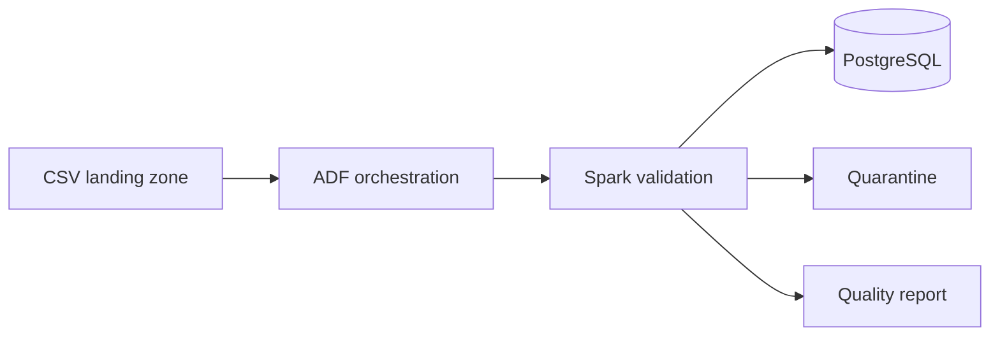

# Retail Analytics Pipeline

An end-to-end batch data pipeline that ingests retail transactions, validates and deduplicates them with Apache Spark, and loads analytics-ready records into PostgreSQL. Azure Data Factory (ADF) definitions orchestrate ingestion, transformation, and quality reporting.

## What this demonstrates

- Spark ETL designed for 500K+ transaction records
- Explicit schema enforcement and quarantine of invalid rows
- Deterministic deduplication using `transaction_id` and latest `updated_at`
- Idempotent PostgreSQL upserts
- Auditable JSON quality reports for every run
- CI checks for transformation logic and configuration

## Architecture



## Quick start

Prerequisites: Python 3.11+, Java 17, Docker, and Docker Compose.

```bash
cp .env.example .env
docker compose up -d postgres
python -m venv .venv
source .venv/bin/activate
pip install -r requirements.txt
python scripts/generate_data.py --rows 500000 --output data/generated/transactions.csv
spark-submit src/retail_pipeline/job.py \
  --input data/generated/transactions.csv \
  --quality-output artifacts/quality-report \
  --quarantine-output artifacts/quarantine
```

For a fast demo, replace the generated input with `data/sample/transactions.csv`.

## Quality rules

| Rule | Action |
|---|---|
| Missing transaction/customer/product ID | Quarantine |
| Quantity <= 0 | Quarantine |
| Unit price < 0 | Quarantine |
| Unsupported channel | Quarantine |
| Duplicate transaction ID | Keep latest `updated_at` |

## Tests

```bash
python -m unittest discover -s tests -v
```

## Repository map

- `src/retail_pipeline/`: Spark job and reusable quality logic
- `sql/`: PostgreSQL schema
- `adf/`: deployable ADF resource definitions
- `scripts/`: deterministic synthetic-data generator
- `.github/workflows/`: CI pipeline

## Results

The included sample intentionally contains one duplicate and three invalid rows. A pipeline run writes accepted records to PostgreSQL, rejected records to quarantine, and aggregate counts to a timestamped quality report.

## Future improvements

- Replace local landing files with ADLS Gen2
- Add incremental watermarking and partition pruning
- Export OpenLineage events and pipeline SLAs

## License

MIT
